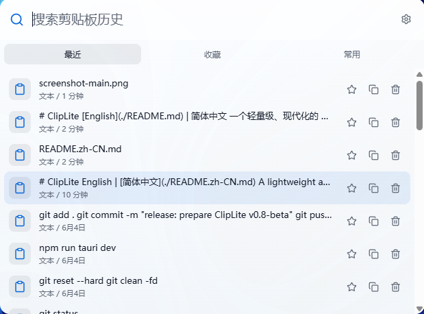
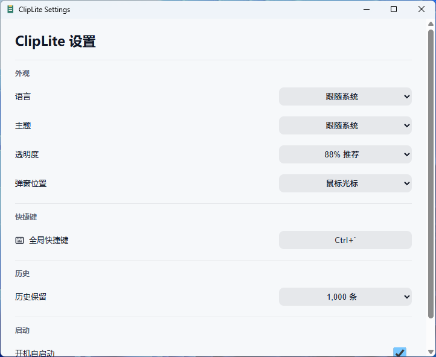

# ClipLite

[English](./README.md) | 简体中文

一个轻量级、现代化的 Windows 剪贴板启动器。

ClipLite 支持快捷键呼出、搜索剪贴板历史、收藏常用内容、图片与文件路径记录，适合开发者和日常办公用户快速找回、粘贴、管理剪贴板内容。

## 功能特性

- 全局快捷键呼出剪贴板面板
- 支持关键词搜索历史剪贴板内容
- 支持文本、图片、文件路径记录
- 支持收藏重要内容
- 支持常用内容统计，按使用频率排序
- 支持深色 / 浅色主题
- 支持透明度、窗口宽度、字体大小配置
- 支持窗口位置设置
- 支持中文 / 英文切换
- 本地 SQLite 存储
- 注重隐私：数据默认只保存在本机

## 下载

前往 [Releases](../../releases) 页面下载最新版安装包。

## 使用方式

1. 安装并启动 ClipLite
2. 使用全局快捷键呼出窗口
3. 输入关键词搜索剪贴板历史
4. 按 Enter 粘贴选中的内容

## 截图

### 主界面

### 设置界面

## 技术栈

- Tauri
- Vue 3
- TypeScript
- SQLite
- Rust

## 为什么做 ClipLite？

Windows 系统自带剪贴板功能比较简单，传统剪贴板工具功能强大但界面相对陈旧。

ClipLite 希望提供一个更轻量、更现代、更适合高频使用的剪贴板工具，使用体验接近 Raycast、PowerToys Run 这类启动器风格工具。

## 适合谁使用？

- 经常复制粘贴代码片段的开发者
- 需要反复填写文本的办公用户
- 希望快速搜索历史剪贴板内容的用户
- 喜欢轻量级桌面效率工具的人

## Roadmap

- [x] 文本剪贴板历史
- [x] 收藏内容
- [x] 常用内容统计
- [x] 图片记录
- [x] 文件路径记录
- [x] 主题切换
- [x] 中文 / 英文切换
- [x] 透明度设置
- [x] 窗口位置设置
- [ ] 更稳定的开机自启动
- [ ] 更新提示
- [ ] 更多粘贴模式
- [ ] 快捷键自定义增强

## 隐私说明

ClipLite 的剪贴板数据默认存储在本地 SQLite 数据库中。  
数据不会上传到任何服务器。

## License

MIT
